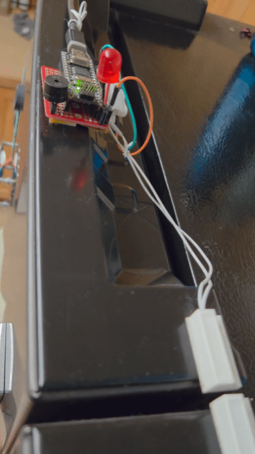
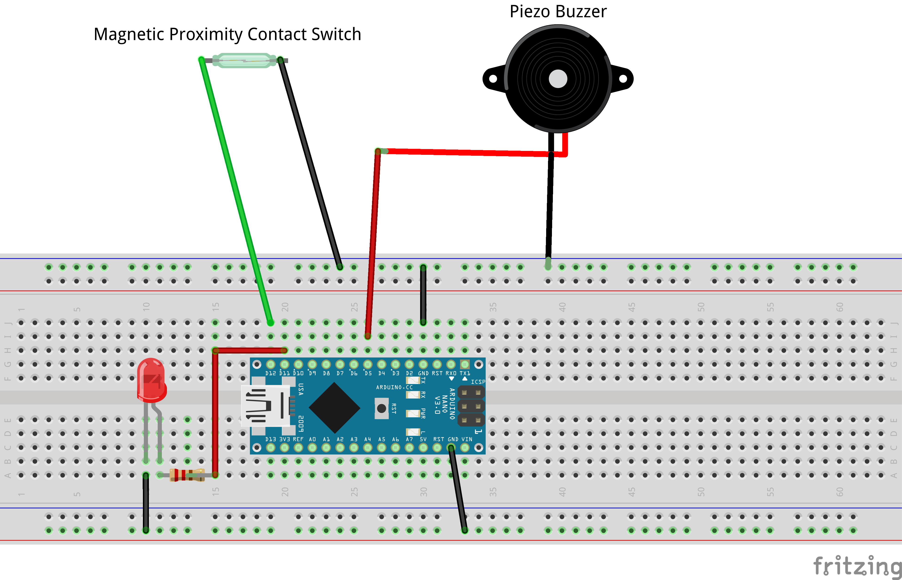
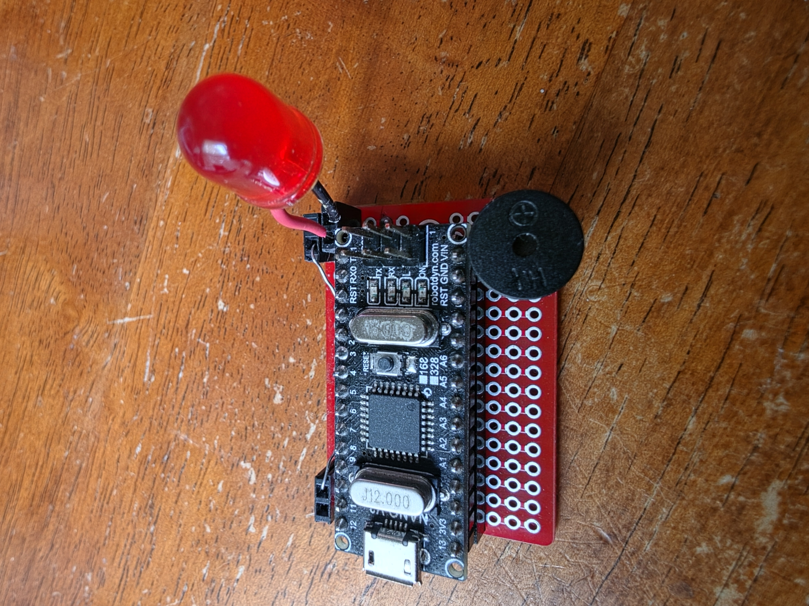

# Fridge Alarm

A refrigerator alarm that illuminates a red LED and activates a piezo buzzer if the door is left open

## Overview

Much to my chagrin, I would often leave my refrigerator door slightly ajar without realizing it. This lets the cool air out, eventually making the food bad and the household sad. Quite the bummer that the fridge I own did not come with an alarm feature out of the box.

So, I wanted a simple solution using existing parts I already had on hand. This was it. Use a microcontroller to detect that the door is open when the connection of a magnetic proximity contact switch is broken.

If the refrigerator door is open, a RED led light turns on. If the door is closed, the RED light turns off. An alarm will beep if the door is still open after a set number of seconds has passed. Nothing fancy.

This ain't pretty, but it works 🔥


## Hardware

| Parts                     
| ------------------------------
| Arduino Nano V3
| Piezo buzzer
| Red LED
| 220Ω resistor
| [Magnetic proximity/reed switch](https://www.sparkfun.com/magnetic-door-switch-set.html)
| [Solder-able Breadboard - Mini](https://www.sparkfun.com/sparkfun-solder-able-breadboard-mini.html)
| Jumper wires
| 5V power supply


## Software

### Requirements

* Arduino IDE
* Arduino UNO board package

### Configuration

Pin Definitions:
```cpp
#define LED_PIN 11
#define SWITCH_PIN 12
#define BUZZ_PIN 5
```

Number of seconds to trigger the alarm:
```cpp
 int numberOfSecs = 120;
```
---

## Circuit Diagram

### Fritzing Diagram



---

## Uploading the Software

1. Connect the Arduino UNO board to the computer using USB.

2. Open the project in the Arduino IDE.

3. Select:

   **Tools → Board → Arduino Nano**

4. Select
   
   **Tools → Processor → ATmega328P**

5. Select the appropriate serial port.

6. Compile the [sketch](./fridge_alarm.ino).

7. Upload the sketch to the Arduino.

---

## Reference

[Arduino IDE](https://support.arduino.cc/hc/en-us/articles/360019833020-Download-and-install-Arduino-IDE)

[Nano V3 Pinouts](https://robotdyn.com/nano-v3-ch340)

